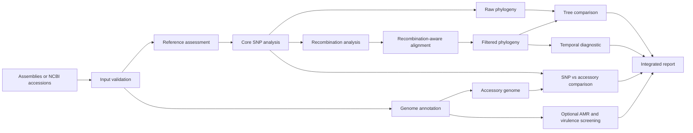
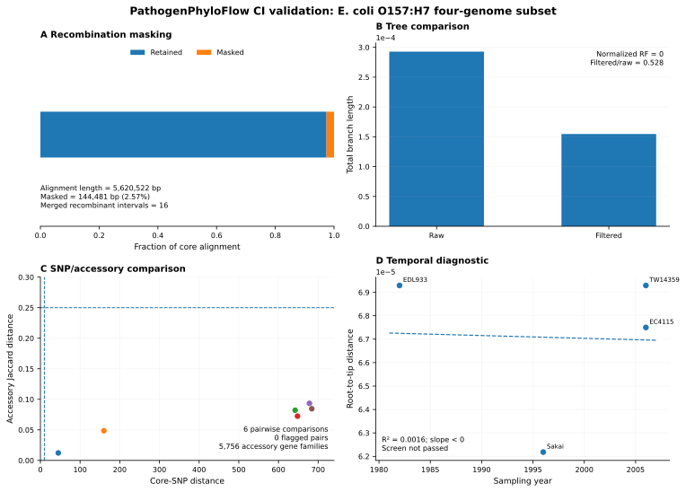
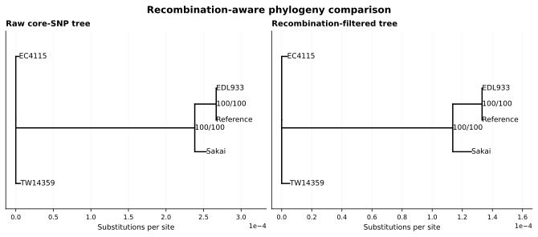
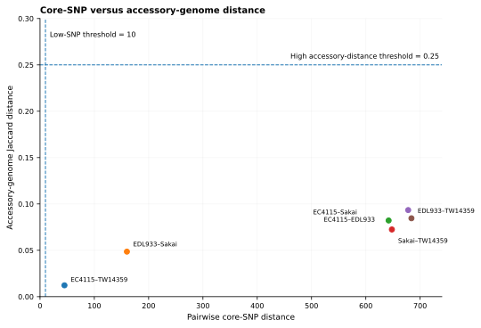
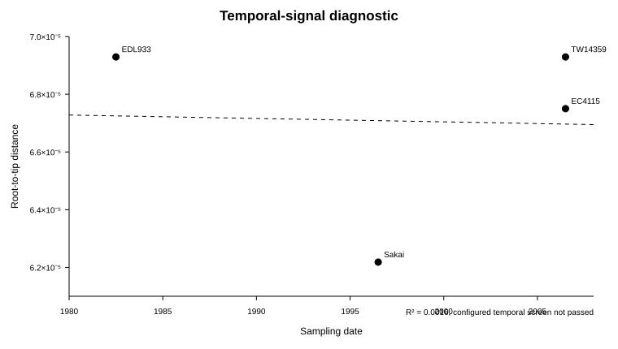

# PathogenPhyloFlow

[](https://github.com/mbilal-OU/PathogenPhyloFlow/actions/workflows/ci.yml)
[](https://github.com/mbilal-OU/PathogenPhyloFlow/actions/workflows/end-to-end-smoke.yml)
[](https://github.com/mbilal-OU/PathogenPhyloFlow/actions/workflows/real-data-smoke.yml)
[](LICENSE)

**PathogenPhyloFlow** is a modular Snakemake workflow for integrated bacterial pathogen genomics. It combines core-SNP phylogeny, recombination-aware inference, accessory-genome variation, functional screening, temporal diagnostics, and reproducible reporting.

The central idea is simple: **a pathogen tree should not be interpreted in isolation.**

## Workflow at a glance



## Reproducible example results

The repository includes a 10-genome *Escherichia coli* O157:H7 tutorial and a smaller four-genome continuous-integration subset used for full workflow validation. The figures below come from a successful CI run of that four-genome subset. They are committed as static SVGs so the README shows actual workflow behavior rather than mock output.



### Raw and recombination-filtered phylogenies



In this validation run, 144,481 of 5,620,522 alignment positions were masked as recombinant, or **2.57%** of the alignment. The raw and filtered trees retained the same topology in this small panel, with normalized Robinson-Foulds distance **0**, while the filtered total branch length was **52.8%** of the raw-tree length.

### Core-SNP distance versus accessory-genome distance



The four-genome panel produced **5,756 accessory gene families**. Six pairwise comparisons were evaluated. None crossed both configured discordance thresholds in this validation subset. The workflow reports such flags as investigation targets, not transmission calls.

### Temporal diagnostic



The four dated samples span 24 years, but the root-to-tip diagnostic had **R² = 0.0016** with a negative slope. The configured temporal screen therefore did not pass. PathogenPhyloFlow retains that negative result instead of forcing a dated-tree analysis.

The compact source outputs used for the preview are in [`examples/ecoli_o157/results_preview`](examples/ecoli_o157/results_preview/README.md).

> **Interpretation note:** this example is a workflow-validation panel, not a single epidemiologically linked outbreak. Genomic proximity in the tutorial must not be interpreted as direct transmission.

## What makes the workflow different

PathogenPhyloFlow does not stop at `SNPs -> tree`. It keeps distinct evidence layers separate and then brings them together in one report.

- Local assemblies or NCBI `GCA_` / `GCF_` accessions as input
- Transparent reference assessment using assembly statistics and Mash distance
- Snippy-based core-SNP analysis
- Raw and recombination-aware phylogenies
- Gubbins recombination analysis with explicit before/after comparison
- Pairwise SNP distances
- Prokka plus Panaroo accessory-genome analysis
- Optional ResFinder and VFDB screening with ABRicate
- SNP/accessory discordance analysis
- Root-to-tip temporal screening before optional TreeTime execution
- Integrated HTML and JSON reporting
- Modular Snakemake rules, isolated Conda environments, schema validation, unit tests, DAG tests, and end-to-end CI

## Scientific guardrails

The workflow is designed to make several common overinterpretations harder.

- A small SNP distance is **not automatically called transmission**.
- Recombination filtering is configurable and its impact is retained and reported.
- Temporal inference is screened before TreeTime can run automatically.
- Reference selection is recorded and auditable.
- Genomic clusters are treated as hypotheses that require epidemiological context.
- Accessory-genome differences remain visible so clonal relatedness is not confused with functional equivalence.

See [Scientific guardrails](docs/SCIENTIFIC_GUARDRAILS.md).

## Quick start

### 1. Create the workflow environment

```bash
mamba env create -f environment.yaml
conda activate pathogenphyloflow
```

### 2. Prepare the sample sheet

```bash
cp config/samples.example.tsv config/samples.tsv
```

Each row supplies either a local assembly path or an NCBI assembly accession.

```text
sample  assembly  accession  date  location  host
```

Extra metadata columns are allowed and are retained in run metadata and the HTML report.

Update `samples:` in `config/config.yaml` to point to your sample sheet.

### 3. Inspect the planned run

```bash
snakemake --snakefile workflow/Snakefile --use-conda --cores 8 --dry-run
```

### 4. Run the workflow

```bash
snakemake --snakefile workflow/Snakefile --use-conda --cores 8
```

The main report is written to:

```text
results/report/index.html
```

## O157:H7 tutorial dataset

A curated 10-genome *E. coli* O157:H7 validation panel is available in [`examples/ecoli_o157`](examples/ecoli_o157/README.md). It includes public assemblies from different sources, locations, and years so multiple workflow branches can be exercised without implying one transmission chain.

Run the tutorial with:

```bash
snakemake \
  --snakefile workflow/Snakefile \
  --configfile examples/ecoli_o157/config.yaml \
  --use-conda \
  --cores 8
```

The separate four-genome CI configuration is intentionally smaller so GitHub Actions can repeatedly validate the complete workflow.

## Recombination analysis

Recombination analysis is enabled in the default configuration so its effect can be measured rather than assumed.

```yaml
recombination:
  enabled: true
```

PathogenPhyloFlow retains both raw and recombination-aware results and records how masking changes the alignment and phylogeny.

## Temporal modes

```yaml
temporal:
  mode: screen
```

| Mode | Behaviour |
|---|---|
| `off` | No temporal interpretation |
| `screen` | Root-to-tip diagnostic only |
| `auto` | Run TreeTime only if configured screening criteria are met |
| `on` | Run TreeTime after basic date validation |

The root-to-tip screen is a diagnostic, not proof of a molecular clock. Publication-grade phylodynamic inference may require stronger temporal validation.

## Major outputs

```text
results/
├── input/
├── reference/
├── variants/
├── recombination/
├── phylogeny/
├── accessory/
├── functional/
├── integration/
├── temporal/
└── report/
```

See [Output reference](docs/OUTPUTS.md) for file-level details.

## Project structure

```text
PathogenPhyloFlow/
├── pathogenphyloflow/     # shared Python package
├── config/
├── docs/
│   └── assets/
├── examples/
├── tests/
├── workflow/
│   ├── envs/
│   ├── rules/
│   └── scripts/
├── environment.yaml
├── pyproject.toml
└── README.md
```

The workflow is split into focused rule modules rather than one monolithic Snakefile.

## Relationship to PanPhyloFlow

The projects are complementary.

- **PanPhyloFlow** focuses on pangenome-based phylogenomics and broader evolutionary relationships.
- **PathogenPhyloFlow** focuses on closely related pathogen isolates, core-SNP evolution, recombination, accessory-genome change, and epidemiological context.

## Validation status

The current foundation is tested at three levels:

1. Python unit tests
2. Snakemake DAG construction
3. End-to-end execution of the four-genome CI validation subset with stable-output checks

The larger 10-genome tutorial is retained as the public demonstration dataset.

## Citation

If you use the workflow in research, cite the software version or commit used. A [`CITATION.cff`](CITATION.cff) file is included for GitHub citation export.

## License

MIT License. See [LICENSE](LICENSE).
