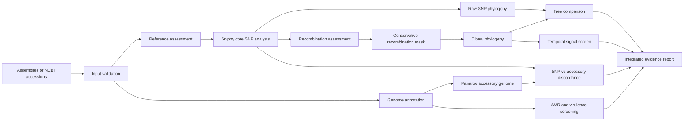

# PathogenPhyloFlow

[](https://github.com/mbilal-OU/PathogenPhyloFlow/actions/workflows/ci.yml)
[](LICENSE)

**PathogenPhyloFlow** is a modular Snakemake workflow for integrated bacterial pathogen genomics. It combines clonal SNP phylogeny, recombination-aware inference, accessory-genome variation, functional screening, temporal diagnostics, and evidence synthesis in one reproducible analysis.

The project is designed around a simple principle: **a pathogen tree should not be interpreted in isolation.** Closely related isolates can differ in recombinant regions, accessory genes, resistance determinants, virulence factors, sampling time, host, and geography.

## What makes this workflow different

PathogenPhyloFlow does not stop at `SNPs -> tree`. It keeps multiple evolutionary signals separate, then brings them together for interpretation.



### Core capabilities

- Local assemblies or NCBI `GCA_` / `GCF_` accessions as input
- Transparent reference assessment using assembly quality and Mash distance
- Snippy-based core SNP analysis
- Raw and recombination-aware phylogenies
- Gubbins recombination detection with an explicit before/after comparison
- SNP distance matrices
- Prokka plus Panaroo accessory-genome analysis
- Optional ResFinder and VFDB screening with ABRicate
- SNP/accessory discordance analysis
- Root-to-tip temporal screening before optional TreeTime execution
- Integrated HTML and JSON reporting
- Modular rule files, isolated Conda environments, configuration validation, and CI tests

## Scientific guardrails

PathogenPhyloFlow deliberately avoids several common overinterpretations.

- A small SNP distance is **not automatically called transmission**.
- Recombination filtering is configurable and its impact is reported rather than hidden.
- Temporal inference is screened before TreeTime is allowed to run automatically.
- Reference selection is recorded and auditable.
- Candidate genomic clusters are reported as hypotheses that require epidemiological context.
- Accessory-genome differences are retained so clonal relatedness is not confused with functional equivalence.

See [Scientific guardrails](docs/SCIENTIFIC_GUARDRAILS.md).

## Quick start

### 1. Create the workflow environment

```bash
mamba env create -f environment.yaml
conda activate pathogenphyloflow
```

### 2. Prepare the sample sheet

Copy the template and replace the example rows with your samples.

```bash
cp config/samples.example.tsv config/samples.tsv
```

Each sample can provide either a local assembly path or an NCBI assembly accession.

```text
sample  assembly  accession  date  location  host
```

Then update `samples:` in `config/config.yaml` to `config/samples.tsv`.

### 3. Inspect the planned run

```bash
snakemake --snakefile workflow/Snakefile --use-conda --cores 8 -n
```

### 4. Run

```bash
snakemake --snakefile workflow/Snakefile --use-conda --cores 8
```

The main report will be written to:

```text
results/report/index.html
```

## Recombination modes

The default configuration keeps recombination analysis enabled because its effect should be measurable rather than assumed.

```yaml
recombination:
  enabled: true
```

PathogenPhyloFlow retains both the raw and recombination-aware results and quantifies how masking changes the alignment and tree.

## Temporal modes

```yaml
temporal:
  mode: screen
```

Available modes:

| Mode | Behaviour |
|---|---|
| `off` | No temporal interpretation |
| `screen` | Root-to-tip diagnostic only |
| `auto` | Run TreeTime only if configured screening criteria are met |
| `on` | Run TreeTime after basic date validation |

The root-to-tip screen is a diagnostic, not proof of a molecular clock. Date-randomization and epidemiological validation may still be required for publication-grade phylodynamic inference.

## Project structure

```text
PathogenPhyloFlow/
├── config/
├── docs/
├── tests/
├── workflow/
│   ├── envs/
│   ├── lib/
│   ├── rules/
│   └── scripts/
├── environment.yaml
└── README.md
```

The workflow is intentionally split into small rule modules rather than one monolithic Snakefile.

## Major outputs

```text
results/
├── input/
├── reference/
├── variants/
├── recombination/
├── phylogeny/
├── accessory/
├── functional/
├── integration/
├── temporal/
└── report/
```

See [Output reference](docs/OUTPUTS.md) for details.

## Relationship to PanPhyloFlow

These are complementary projects with different biological targets.

- **PanPhyloFlow** focuses on pangenome-based phylogenomics and deeper evolutionary relationships.
- **PathogenPhyloFlow** focuses on closely related pathogen isolates, core SNP evolution, recombination, accessory-genome change, and epidemiological context.

## Status

PathogenPhyloFlow is under active development. The current implementation is an early public workflow intended for transparent testing and community feedback. Interfaces may evolve before the first stable release.

## Citation

If you use the workflow in research, please cite the software version or commit used. A `CITATION.cff` file is included for GitHub citation export.

## License

MIT License. See [LICENSE](LICENSE).
